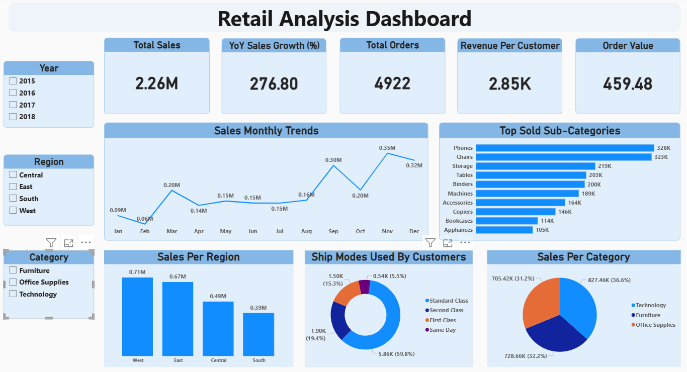

# 🛍️ Retail Insights Dashboard — Power BI

### 📊 Overview
This Power BI project was created as part of my **Data Analytics Internship at Elevvo Pathways**.  
It focuses on analyzing retail data to uncover key insights on sales, customers, and product performance.

---

### 🧩 Key Features
- **KPIs:** Total Sales, Orders, Revenue per Customer, YoY Growth
- **Sales Monthly Trends:** Identify peak months and seasonal patterns
- **Top Sub-Categories:** Highlight high-performing product types
- **Sales by Region:** Compare performance across markets
- **Shipping Modes:** Breakdown of customer delivery preferences
- **Sales per Category:** Visualize the revenue contribution by category

---

### 🛠️ Tools Used
- **Power BI** for data visualization  
- **Excel / CSV** for data preparation  

---

### 💡 Key Learning
This project strengthened my skills in:
- Power BI dashboard design  
- Data modeling and DAX  
- Visual storytelling and performance analysis

---

### 📸 Dashboard Preview

